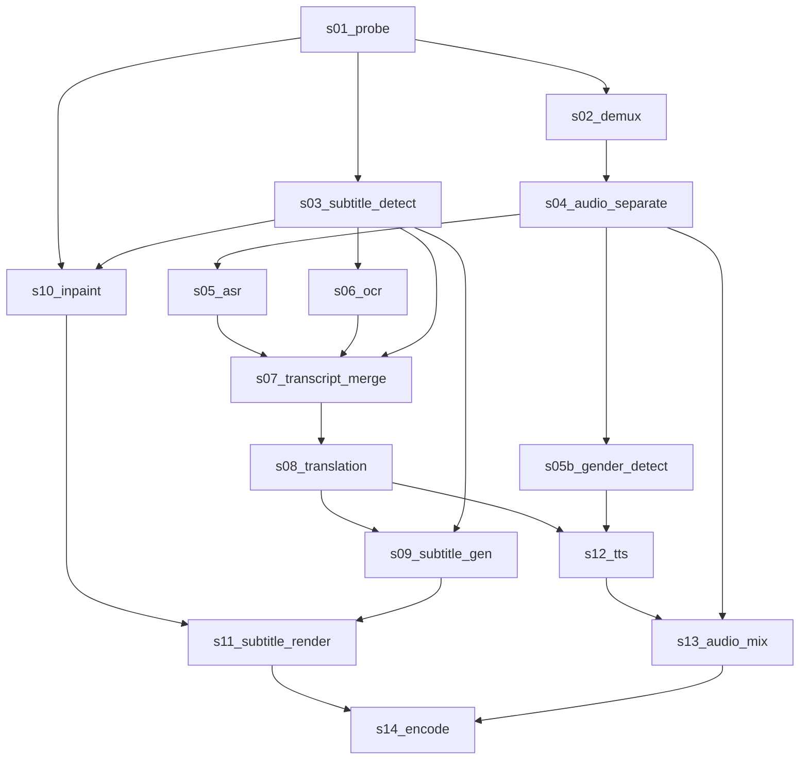

# 📜 Tài liệu Chi tiết 15 Bước trong Pipeline (`lib/steps/`)

Thư mục `lib/steps/` chứa toàn bộ 15 bước xử lý của hệ thống **AI Video Translator (Sub-Video)**. Mỗi bước kế thừa từ lớp cơ sở [`StepBase`](file:///Users/voquyt/Documents/projects/video/Sub-Video/lib/core/step_base.py) và chạy độc lập với cơ chế cache thông minh (**Smart Config Invalidation**).

---

## 🗺️ Tổng quan Luồng Pipeline 15 Bước



---

## 🛠️ Chi tiết từng Step & Ví dụ Minh họa

### 1. `s01_probe` — Probe Video Info
- **File**: [`lib/steps/s01_probe.py`](file:///Users/voquyt/Documents/projects/video/Sub-Video/lib/steps/s01_probe.py)
- **Chức năng**: Phân tích các thuộc tính kỹ thuật của video gốc bằng FFmpeg/ffprobe (độ phân giải, fps, thời lượng, luồng âm thanh/phụ đề nhúng).
- **Input**: Video gốc (e.g. `video_001.mp4`).
- **Output**: JSON chứa thông tin kỹ thuật video.
- **Ví dụ Output**:
  ```json
  {
    "width": 1080,
    "height": 1920,
    "duration": 45.2,
    "fps": 30.0,
    "has_audio": true,
    "has_subtitle": false
  }
  ```

---

### 2. `s02_demux` — Demux Video & Audio
- **File**: [`lib/steps/s02_demux.py`](file:///Users/voquyt/Documents/projects/video/Sub-Video/lib/steps/s02_demux.py)
- **Chức năng**: Tách riêng luồng video (không tiếng) và luồng âm thanh gốc thành 2 file độc lập.
- **Input**: Video gốc.
- **Output**: 
  - `video_stream.mp4` (video không tiếng)
  - `audio_stream.wav` (âm thanh gốc WAV 44.1kHz)

---

### 3. `s03_subtitle_detect` — Subtitle Detection
- **File**: [`lib/steps/s03_subtitle_detect.py`](file:///Users/voquyt/Documents/projects/video/Sub-Video/lib/steps/s03_subtitle_detect.py)
- **Chức năng**: Phát hiện vị trí phụ đề cũ trên video. Kiểm tra phụ đề nhúng (soft-sub) hoặc xác định tọa độ vùng sub cứng (hard-sub burn-in).
- **Input**: `probe_info`, `config.yaml` (`inpaint_region`).
- **Output**:
  ```json
  {
    "mode": "burnin",
    "burnin_region": [0.80, 0.05, 0.92, 0.95]
  }
  ```
  *(Vùng tọa độ tỉ lệ `[top, left, bottom, right]` từ 0.0 đến 1.0)*.

---

### 4. `s04_audio_separate` — Audio Separation & Noise Reduction
- **File**: [`lib/steps/s04_audio_separate.py`](file:///Users/voquyt/Documents/projects/video/Sub-Video/lib/steps/s04_audio_separate.py)
- **Chức năng**: Sử dụng mô hình **Demucs AI** (`htdemucs`) để tách âm thanh gốc thành giọng nói (`vocals.wav`) và nhạc nền (`no_vocals.wav`). Tự động áp dụng **Spectral Gate Noise Reduction** (`noisereduce`) lọc tiếng ù/ghost voice trong nhạc nền.
- **Input**: `audio_stream.wav`.
- **Output**:
  - `vocals.wav` (Giọng thoại đã lọc tiếng ù)
  - `no_vocals.wav` (Nhạc nền sạch)
  - `orig_voice.wav` (Giọng gốc phục vụ trộn âm)

---

### 5. `s05_asr` — Speech to Text (ASR)
- **File**: [`lib/steps/s05_asr.py`](file:///Users/voquyt/Documents/projects/video/Sub-Video/lib/steps/s05_asr.py)
- **Chức năng**: Nhận diện giọng nói thành văn bản kèm mốc thời gian bằng **Whisper MLX** (`large-v3-turbo`). Tự động chạy qua `RepetitionCleaner` để xóa bỏ ảo giác Whisper (các câu lặp vô nghĩa).
- **Input**: `vocals.wav`.
- **Output** (`s05_asr.json`):
  ```json
  [
    {
      "start": 1.25,
      "end": 3.40,
      "text": "这套穿搭非常适合春天"
    }
  ]
  ```

---

### 6. `s05b_gender_detect` — Voice Gender Detection
- **File**: [`lib/steps/s05b_gender_detect.py`](file:///Users/voquyt/Documents/projects/video/Sub-Video/lib/steps/s05b_gender_detect.py)
- **Chức năng**: Phân tích tần số cơ bản (F0 Pitch) bằng thuật toán Autocorrelation trên file `vocals.wav` tại từng mốc thời gian câu thoại để gán nhãn giới tính **Nam** (`male`) hoặc **Nữ** (`female`).
- **Input**: `vocals.wav`, `s05_asr.json`.
- **Output** (`s05b_gender.json`):
  ```json
  [
    {
      "start": 1.25,
      "end": 3.40,
      "text": "这套穿搭非常适合春天",
      "gender": "female",
      "pitch_hz": 215.4
    }
  ]
  ```

---

### 7. `s06_ocr` — Hard Subtitle OCR
- **File**: [`lib/steps/s06_ocr.py`](file:///Users/voquyt/Documents/projects/video/Sub-Video/lib/steps/s06_ocr.py)
- **Chức năng**: Trích xuất chữ trực tiếp từ hình ảnh sub cứng bằng **PaddleOCR**. Mặc định sử dụng chế độ `ocr_mode: region` (skip OCR 0s để tối ưu tốc độ).
- **Input**: `video_stream.mp4`, `burnin_region`.
- **Output** (`s06_ocr.json`): Danh sách text trích xuất từ khung hình.

---

### 8. `s07_transcript_merge` — Transcript Merge & Filter
- **File**: [`lib/steps/s07_transcript_merge.py`](file:///Users/voquyt/Documents/projects/video/Sub-Video/lib/steps/s07_transcript_merge.py)
- **Chức năng**: Gộp kết quả ASR và OCR thành 1 bản ghi thời gian thống nhất. Tự động áp dụng [`RepetitionCleaner`](file:///Users/voquyt/Documents/projects/video/Sub-Video/lib/utils/repetition_cleaner.py) làm sạch triệt để lặp từ.
- **Input**: `s05_asr.json`, `s06_ocr.json`.
- **Output** (`s07_transcript.json`): Bản ghi lời thoại chuẩn bị đưa đi dịch.

---

### 9. `s08_translation` — LLM Subtitle Translation
- **File**: [`lib/steps/s08_translation.py`](file:///Users/voquyt/Documents/projects/video/Sub-Video/lib/steps/s08_translation.py)
- **Chức năng**: Dịch câu thoại sang ngôn ngữ đích tiếng Việt bằng LLM (**Ollama Qwen2.5** / **OpenAI/Gemini/Groq**). Tự động thu gọn lặp từ tiếng Việt.
- **Input**: `s07_transcript.json`, `target_lang: vi`.
- **Output** (`s08_translation.json`):
  ```json
  [
    {
      "start": 1.25,
      "end": 3.40,
      "text": "Bộ trang phục này rất hợp với mùa xuân"
    }
  ]
  ```

---

### 10. `s09_subtitle_gen` — Subtitle Generation (`.srt`)
- **File**: [`lib/steps/s09_subtitle_gen.py`](file:///Users/voquyt/Documents/projects/video/Sub-Video/lib/steps/s09_subtitle_gen.py)
- **Chức năng**: Sinh file phụ đề `.srt` mới. Tự động tính toán cỡ chữ (`subtitle_font_size`) phù hợp với kích thước vùng xóa sub `inpaint_region`.
- **Input**: `s08_translation.json`.
- **Output**: `subtitles.srt`

---

### 11. `s10_inpaint` — Subtitle Inpainting (Xóa sub cũ)
- **File**: [`lib/steps/s10_inpaint.py`](file:///Users/voquyt/Documents/projects/video/Sub-Video/lib/steps/s10_inpaint.py)
- **Chức năng**: Xóa/làm mờ vùng sub cũ bằng **FFmpeg BoxBlur** (siêu nhanh ~1s) hoặc **OpenCV Inpaint** Telea theo tọa độ `inpaint_region`.
- **Input**: `video_stream.mp4`, `inpaint_region`.
- **Output**: `clean_video.mp4` (video đã được làm mờ/xóa sub cũ).

---

### 12. `s11_subtitle_render` — Subtitle Render (Ghép sub mới)
- **File**: [`lib/steps/s11_subtitle_render.py`](file:///Users/voquyt/Documents/projects/video/Sub-Video/lib/steps/s11_subtitle_render.py)
- **Chức năng**: Ghép file phụ đề tiếng Việt `.srt` vào video sạch bằng FFmpeg subtitles filter (tùy thuộc `show_subtitle: true/false`).
- **Input**: `clean_video.mp4`, `subtitles.srt`.
- **Output**: `rendered_video.mp4`

---

### 13. `s12_tts` — Text to Speech Generation
- **File**: [`lib/steps/s12_tts.py`](file:///Users/voquyt/Documents/projects/video/Sub-Video/lib/steps/s12_tts.py)
- **Chức năng**: Tạo file âm thanh giọng đọc tiếng Việt bằng **EdgeTTS** hoặc **gTTS Ban Mai**. Tự động chuyển đổi giọng Nam (`NamMinhNeural`) hoặc Nữ (`HoaiMyNeural` / `gTTS`) theo nhãn `gender` từ bước `s05b`.
- **Input**: `s08_translation.json`, `s05b_gender.json`, `tts_speed_factor: 1.5`.
- **Output**: `tts_audio.wav` (File âm thanh giọng đọc thuyết minh đã căn khớp thời gian thoại).

---

### 14. `s13_audio_mix` — Audio Mixing
- **File**: [`lib/steps/s13_audio_mix.py`](file:///Users/voquyt/Documents/projects/video/Sub-Video/lib/steps/s13_audio_mix.py)
- **Chức năng**: Trộn âm thanh đa luồng: Nhạc nền (`no_vocals.wav`) + Giọng đọc TTS mới (`tts_audio.wav`) + Giọng gốc nhỏ bên dưới (`orig_voice.wav` nếu `keep_original_voice: true`).
- **Input**: `no_vocals.wav`, `tts_audio.wav`, `original_voice_volume: 0.05`.
- **Output**: `mixed_audio.wav`

---

### 15. `s14_encode` — Final Video Encoding
- **File**: [`lib/steps/s14_encode.py`](file:///Users/voquyt/Documents/projects/video/Sub-Video/lib/steps/s14_encode.py)
- **Chức năng**: Encode kết hợp video (`rendered_video.mp4`) và âm thanh (`mixed_audio.wav`) sang chuẩn **H.264 / AAC** tương thích 100% với macOS QuickTime, iOS và Windows, sau đó xuất ra folder `output/` của project.
- **Input**: `rendered_video.mp4`, `mixed_audio.wav`.
- **Output**: `assets/<project>/output/<video_name>_vi.mp4`
